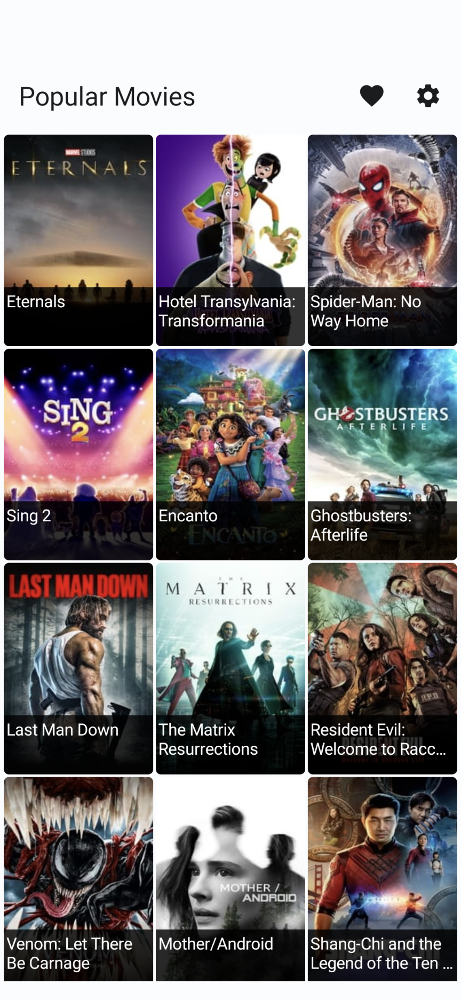
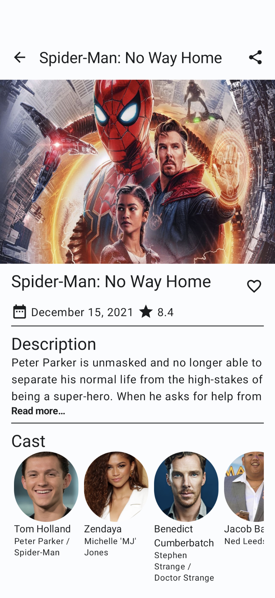
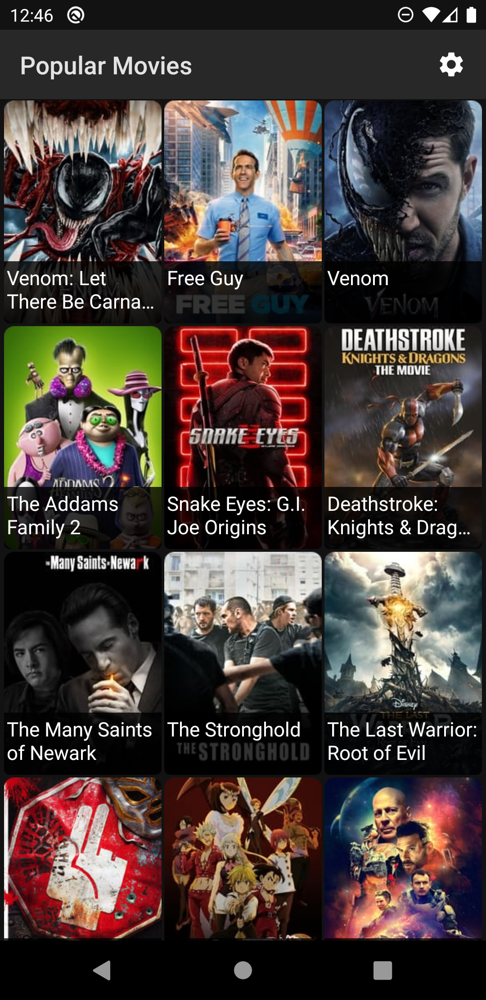

# Chestnut
> A small app for viewing info about popular movies from TMDB.

## Download

## Features ✨

- [x] Fetching movies from TMDB API
- [x] Viewing info about selected movie
- [x] Adding to favorites
- [x] 3 themes (light, dark, purple)

## Built with 🔨

- UI:
  - [Jetpack Compose](https://developer.android.com/jetpack/compose)
  - [Coil](https://github.com/coil-kt/coil)
  - [Accompanist (SystemUIController)](https://google.github.io/accompanist/systemuicontroller/)
  - [Jetpack Navigation Compose](https://developer.android.com/jetpack/compose/navigation)
  - [Paging 3](https://developer.android.com/topic/libraries/architecture/paging/v3-overview)
- Dependency Injection
  - [Hilt](https://developer.android.com/training/dependency-injection/hilt-android)
- Concurrency
  - [Kotlin Coroutines](https://github.com/Kotlin/kotlinx.coroutines)
- Networking
  - [Retrofit 2](https://square.github.io/retrofit/)
  - [Kotlinx Serialization](https://github.com/Kotlin/kotlinx.serialization)
- Data Storage
  - [Room](https://developer.android.com/training/data-storage/room)
  - [Jetpack DataStore](https://developer.android.com/topic/libraries/architecture/datastore)
- Analytics
  - [Sentry](https://sentry.io/)

## TODO 🛠

- [ ] Auth
- [ ] Tests
- [ ] More ideas here...

## Screenshots 📱

<table>
<tr>
<td>

</td>
<td>

</td>
<td>

</td>
</tr>
</table>

## Requirements 🏗

- Android 6.0+